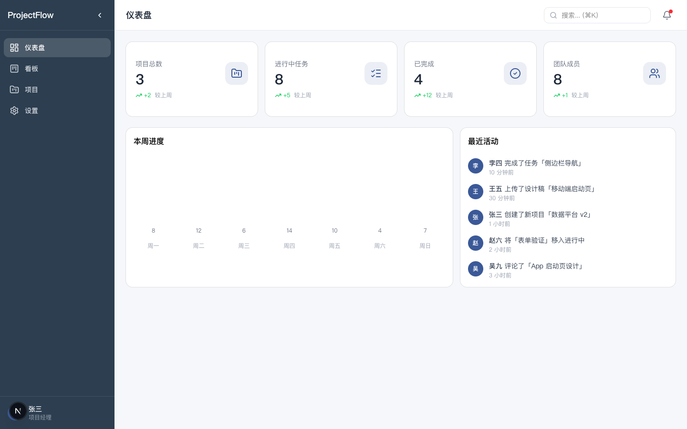
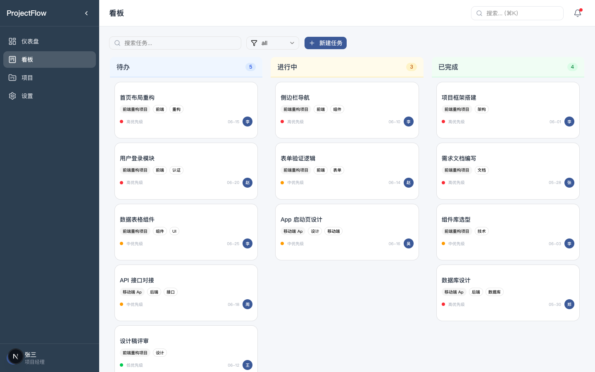
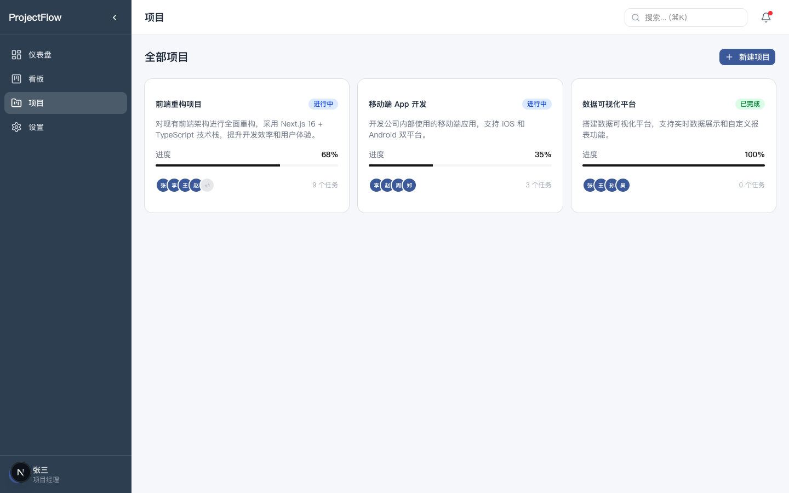
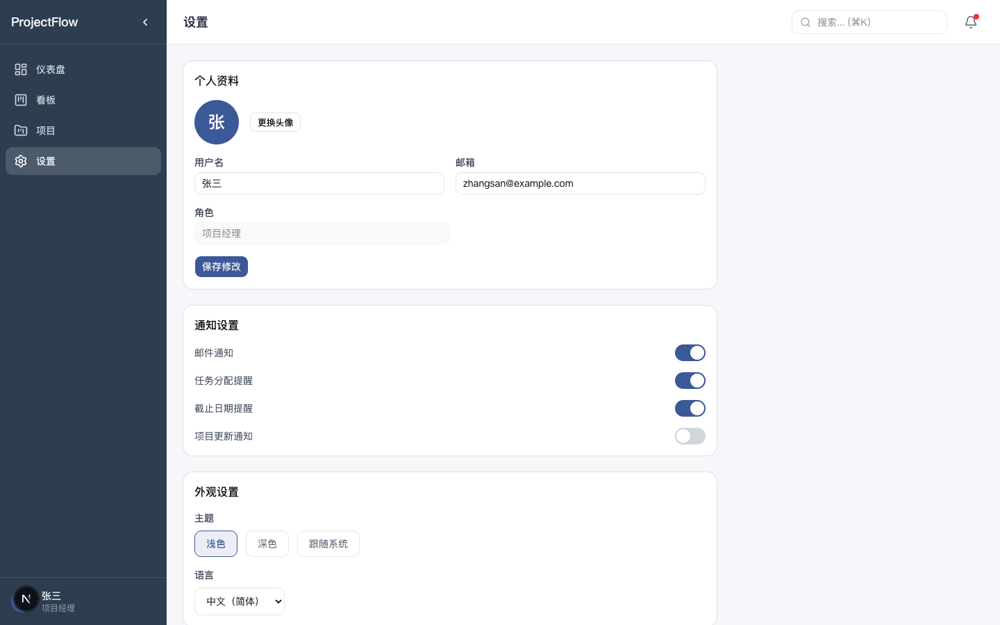

# ProjectFlow — 轻量级项目管理工具

> 面向 5-20 人小团队的项目管理工具，提供看板、任务追踪、团队协作等核心功能。

## 页面预览

### 仪表盘


### 看板视图


### 项目列表


### 设置页面


## 功能特性

- **仪表盘** — 项目概览、4 项统计卡片、周进度柱状图、最近活动流
- **看板视图** — 三列看板（待办/进行中/已完成）、拖拽移动任务、任务 CRUD、搜索筛选
- **项目管理** — 项目列表卡片、详情概览（进度/任务表/成员）、面包屑导航
- **设置页面** — 个人资料编辑、通知开关、主题/语言切换
- **数据持久化** — Zustand + localStorage，刷新不丢数据

## 技术栈

| 分类 | 选择 |
|------|------|
| 框架 | Next.js 16 (App Router) |
| 语言 | TypeScript |
| 样式 | Tailwind CSS v4 |
| UI 组件 | Shadcn UI v4 (@base-ui/react) |
| 状态管理 | Zustand + persist 中间件 |
| 设计工具 | Google Stitch（AI 生成设计稿） |
| 部署 | AWS EC2 + pm2 |
| 包管理 | pnpm |

## 快速开始

### 环境要求

- Node.js >= 22
- pnpm >= 8

### 安装

```bash
git clone https://github.com/lobolluo/project-manager-pc.git
cd project-manager-pc
pnpm install
pnpm dev
```

打开 http://localhost:3000

### 常用命令

```bash
pnpm dev          # 开发
pnpm build        # 构建
pnpm start        # 生产模式运行
pnpm lint         # 代码检查
```

## 项目结构

```
src/
├── app/
│   ├── layout.tsx          # 全局布局（侧边栏+顶栏）
│   ├── page.tsx            # 仪表盘
│   ├── kanban/page.tsx     # 看板页
│   ├── projects/
│   │   ├── page.tsx        # 项目列表
│   │   └── [id]/page.tsx   # 项目详情
│   └── settings/page.tsx   # 设置页
├── components/
│   ├── layout/             # 布局组件（sidebar, header）
│   └── ui/                 # Shadcn UI 组件
├── stores/                 # Zustand Store
│   ├── project-store.ts
│   ├── task-store.ts
│   ├── member-store.ts
│   └── settings-store.ts
├── types/
│   └── index.ts            # 类型定义
└── lib/
    ├── utils.ts            # 工具函数
    └── mock-data.ts        # Mock 数据
```

## 页面路由

| 页面 | 路由 | 说明 |
|------|------|------|
| 仪表盘 | `/` | 统计卡片 + 周进度 + 最近活动 |
| 看板 | `/kanban` | 三列拖拽看板 |
| 项目列表 | `/projects` | 项目卡片网格 |
| 项目详情 | `/projects/[id]` | 概览/任务/成员 Tab |
| 设置 | `/settings` | 个人资料/通知/外观 |

## 部署

AWS EC2 (t3.micro, ap-southeast-1) + pm2 进程管理。

```bash
# SSH 连接
ssh -i ~/.ssh/project-mgr-key.pem ec2-user@<IP>

# 部署
pnpm install && pnpm build
pm2 start pnpm --name "projectflow" -- start
pm2 save && pm2 startup
```

在线访问：http://13.212.154.207:3000

## 标准文档

| 文档 | 用途 |
|------|------|
| [VERSION.md](VERSION.md) | 版本进度 |
| [PRD.md](PRD.md) | 产品需求 |
| [CHANGELOG.md](CHANGELOG.md) | 技术变更记录 |
| [API.md](API.md) | 接口文档 |
| [BACKLOG.md](BACKLOG.md) | 需求池 |
| [ROADMAP.md](ROADMAP.md) | 开发规划 |

## 许可证

MIT
